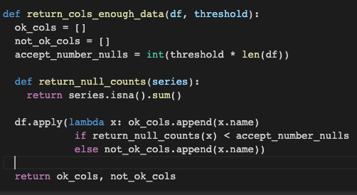
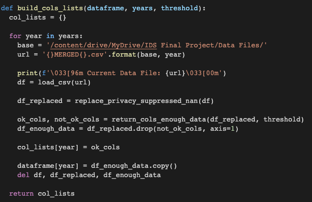
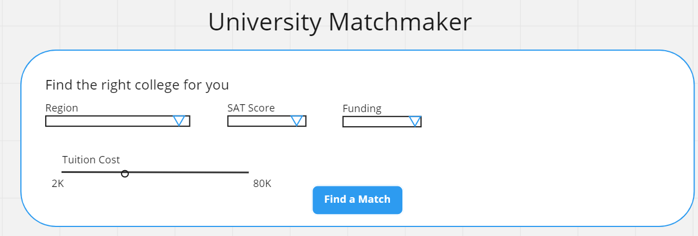
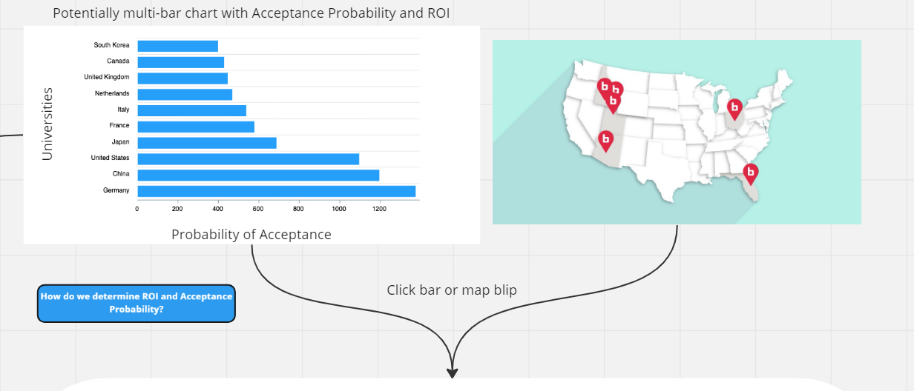
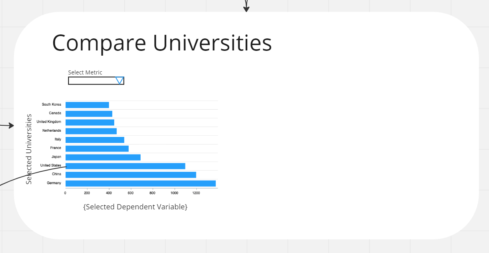

# Final Project Proposal

**GitHub Repo URL**: https://github.com/CMU-IDS-Fall-2022/final-project-roi

Team: 
- Aditya Nittala (snittala)
- Anjana Bytha (abytha)
- Brittany Redmond (bredmond)
- Devin Ulam (dulam)

Each year about 3.2 million students graduate from high school, of which 2 million continue their education going to college [1]. Shortlisting universities is often a cumbersome process which is limited by individual bias and timing constraints. Students need to consider various factors, including but not limited to university ranking, location, tuition cost, financial aid, campus life and safety. Evaluating the importance of these different factors to select a university could be tricky. 

For our analysis we will use the College Scorecard dataset which contains historical data for universities from the years 1996 - 2021 [2]. The data for each year consists of several university level factors and demographic variables of the student population at each university. In this project, we aim to address the issue of shortlisting universities by leveraging this dataset to answer the two following questions. 

**Question 1: What universities are best fit for me?**

Given a student profile based on factors such as location, annual income, age, preferred degree etc., we recommend the top 10 universities that are a best fit for the student. We define “best fit” as the universities the student has the best chance of getting into, and where they will thrive. Additionally, for each of the suggested universities, we present an analysis of various factors over the years. For example- how did the admission rate change over the years, how has the ratio of female vs male students changed, is there a difference in the age of students starting college. 

We believe that our application could provide students a better picture of where they stand in terms of academic requirements and student life expectations. The university recommendations could be a starting point, from which they can make further enquiries and choose schools that work best for them.

**Question 2: What university-level characteristics influence a student’s ROI?**

A student’s ROI is based on the time it takes to recoup their original financial investment toward tuition by earning a salary post-graduation. Using the College Scorecard dataset, we seek to answer the question: What university-level characteristics influence a student’s ROI?

The College Scorecard dataset includes historical metrics dating back to 1996, representing a multitude of factors that could influence the success of a university’s students. We will start by determining ROI for student records spanning between 1996-2020 using tuition, room & board, and expenses as a cost basis. Contrasting the cost basis with post-graduate salaries will provide us an estimated ROI. With this, we can explore the dataset to determine features that influence the variance of ROI across universities and fields of study.  This would include filtering out features such as household income, federal scholarships, student demographics, retention rates, etc. We hope to arrive at a set of features that can be used to predict a given university's average student ROI such that a university could tweak characteristics to optimize student outcomes. This analysis lends itself to a secondary outcome that provides the student a more formal evaluation to utilize in their university selection process. 

We acknowledge that the preliminary questions above are broad in scope. That said, we are likely to encounter more granular questions that further enhance the ultimate goal we are trying to achieve with this dataset: the evaluation of a student-university “best fit”. 

**References:**\
[1] 	The NCES Fast Facts Tool provides quick answers to many education questions (National Center for Education Statistics). National Center for Education Statistics (NCES) Home Page, a part of the U.S. Department of Education. (n.d.). Retrieved November 1, 2022, from https://nces.ed.gov/fastfacts/display.asp?id=51 

[2] 	Data Home: College Scorecard. Data Home | College Scorecard. (n.d.). Retrieved November 1, 2022, from https://collegescorecard.ed.gov/data/ 

## Data Processing
The College Scorecard dataset contains data about universities from 1996 to 2021. There are about 3000 features in the dataset, which are broadly categorized into:
- School: Information about the school like location, programs offered, faculty, etc.
- Student: Information about average age, family income, etc.
- Cost: cost of attending, living expenses, cost according to family income, etc.
- Aid: debt, percent Pell Grant recipients, loan balances, etc.
- Earnings: earnings after 1, 3, 8, 6, 10 yrs, income by gender, race, etc.
- Repayment: 1,3,5 yr repayment rates by family income, percentage of defaulters by program, etc.
- Admissions: SAT scores, ACT scores, etc.
- Academics: percent degree awarded in various fields, avg time required to complete programs, etc.
- Completion: Completion rate according to family income bracket, male, female, etc.

The data is messy, with a lot of null values. 

The first step in narrowing down the features list was to find columns that had "enough" data across the years. We set the threshold as columns having 20% null values. For each of the years, a list was compiled and then intersected with other such lists.

This gave a list of 333 features. We further narrowed down to 45 features by comparing the features to a manually compiled list. Some of the universities did not have location data (latitude, longitude). We used another source to append these values to our dataset.

The dataset now looks like:

## Interactivity
We designed Version 1 of our UI/UX using Miro. The link to access it can be found here:
https://miro.com/app/board/uXjVPFVsL0Q=/?share_link_id=804071138934

In this design, we start with allowing the student to enter some information about themself, including name, field of study, and SAT scores. 

**Matchmaker:** 

Once all inputs are satisfied, the student starts the matchmaker by clicking the "Find a Match" button. They are then presented a summary of the top 10 universities in order of acceptance probability.

###### Acceptance probability is based on the likelihood the university will accept the student in next year's class

We show a bar chart that makes it easy to compare proabilities across universities. We also show a map of the universities for regional preference purposes.

**University Comparisons:**

We then allow the user to compare Universities by clicking multiple bars or multiple map blips. This then populates a new section of visualization that is meant to illustrate the difference in various metrics at the selected universities. 
The user can decide which metric they would like to visualize, but the default is ROI. We include the ability to click on the university which then opens a scatter plot view of a 25 year trend for the selected university's metric that is currently plotted in the bar chart.

###### ROI is a an output of our ROI predictive model that forecasts a student's ROI given both their own and the university's characteristics. 

**University Info:**

Clicking the university's bar on the bar chart also expands a section that presents specifics about that University. This includes:
  1. About the University

  1. Various visualizations such as Pie charts, scatter charts, etc. that highlight important university metrics like gender ratios, scholarship trends, etc.

**ROI Explanation**

Finally, we present a section that details the ROI model's features so that the user better understands what characteristics carry the most weight toward achieving a successful career that returns a better ROI. We utilize several visuals for this, one of which is a waterfall plot representing SHAP values for our features:

